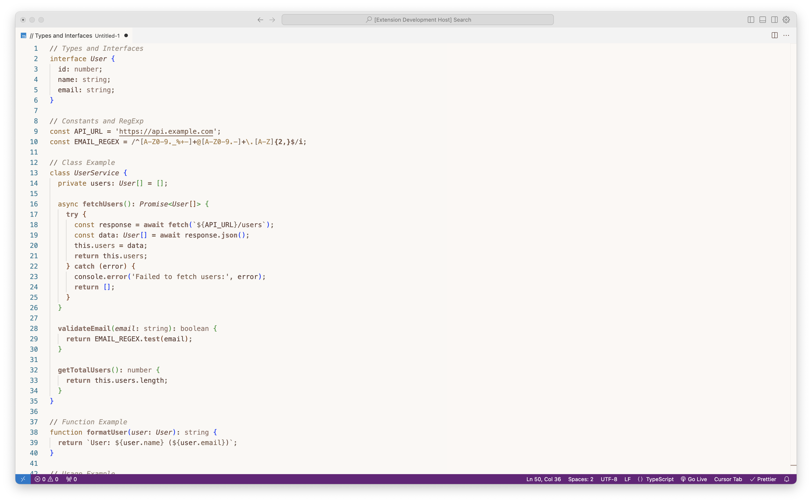
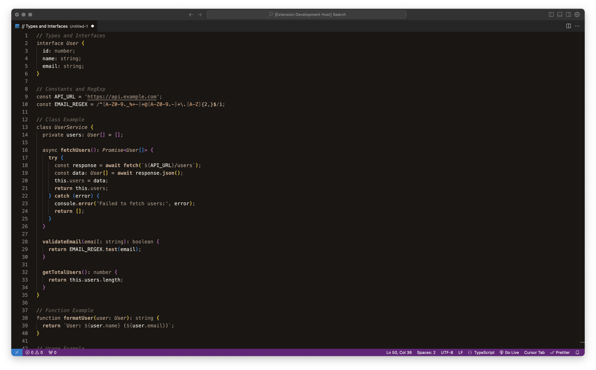

# Cream & Brown Theme for VS Code

A soothing, professional VS Code theme featuring warm cream backgrounds and elegant brown accents, available in both light and dark variants.

## Preview

## Features

- Two carefully crafted variants:
  - Cream Comfort Light: Warm cream background for reduced eye strain
  - Cream Comfort Dark: Elegant dark theme with brown accents
- Perfect contrast for all-day coding
- Professional syntax highlighting
- Ideal for professional environments

## Installation

1. Open VS Code
2. Go to Extensions (Ctrl+Shift+X)
3. Search for "Cream & Brown Theme"
4. Click Install
5. Press Ctrl+K Ctrl+T and select either "Cream Comfort Light" or "Cream Comfort Dark"

## Contributing

Found a bug or have a suggestion? Open an issue or submit a PR on [GitHub](https://github.com/emilbergs/cream-brown-theme).

## License

[MIT License](LICENSE)
